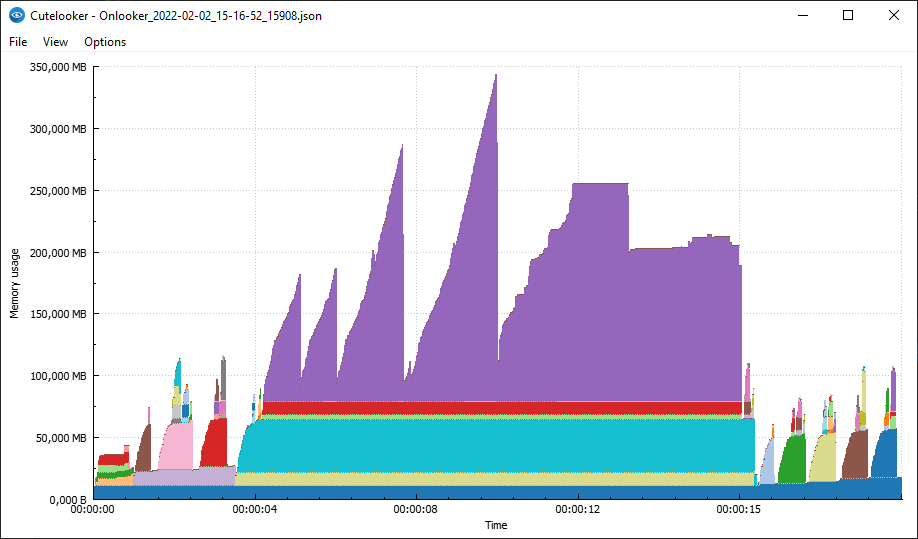
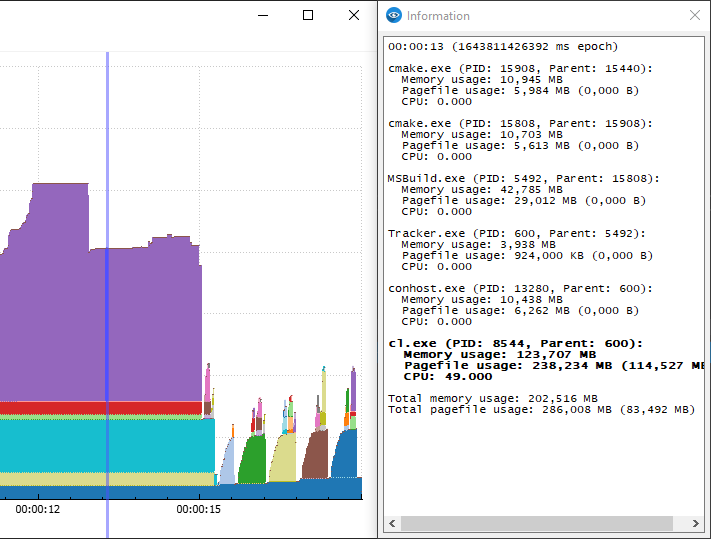
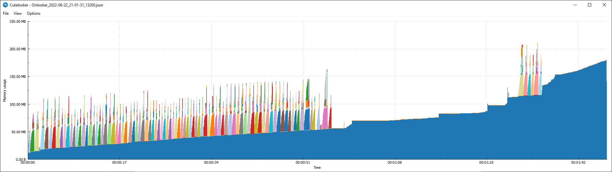
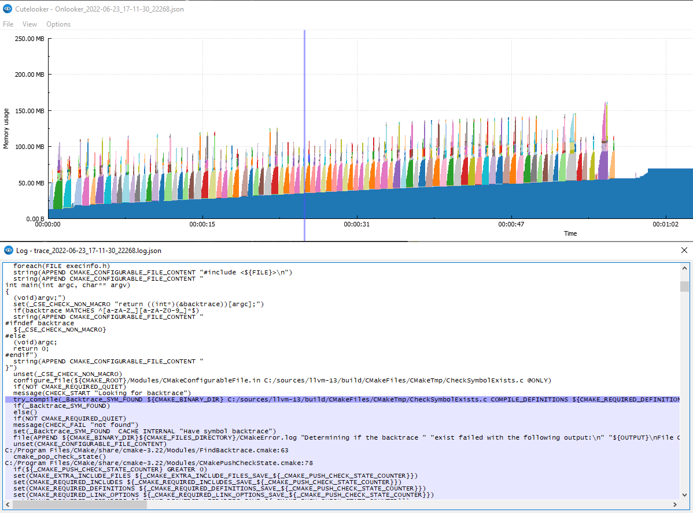

# Introducing Onlooker & Cutelooker

September 16, 2022

## Problem description

After implementing a major update of our product, we started experiencing out-of-memory errors and significant performance degradations when running our protection pipeline.

Our protection pipeline is a native Windows executable that does roughly the following:

- Load the input binary
- Analyze the binary
- Insert security code
- Generate a protected executable

The protection pipeline regularly calls out to external processes to perform various tasks (compiler, assembler, linker, postprocessing). Every step in the pipeline outputs detailed logs. We store these logs together with various build artifacts to allow us to reproduce and analyze (parts of) a protection at a later date.

## Profilers

To a diagnose performance and memory issue, you first need to get an overview of what's going on in your process. This is where profilers come in. Some examples:

- [Intel® VTune™ Profiler](https://www.intel.com/content/www/us/en/developer/tools/oneapi/vtune-profiler.html#gs.nvo66s)
- [Valgrind](https://valgrind.org) (Linux only)
- [VerySleepy](https://github.com/VerySleepy/verysleepy)
- [Dr. Memory](https://drmemory.org)
- [Visual Studio](https://docs.microsoft.com/en-us/visualstudio/profiling/memory-usage?view=vs-2022)
- [Windows Performance Analyzer](https://docs.microsoft.com/en-US/windows-hardware/test/wpt/windows-performance-analyzer)

The tools above are mostly focused on analyzing performance bottlenecks and have varying degrees of overhead. We were looking for something simple and lightweight like Task Manager, but with access to the raw data to enable us to link our existing logs to it. It also needed to support tracking child processes.

On Windows, the closest to what we needed was the Windows Performance Analyzer (WPA). This is a very powerful tool that can be incredibly helpful diagnosing problems. Unfortunately, WPA was difficult to extend and deploy on production server, and the ETW traces can get very large, making it difficult to work with.

## Our solution

On Linux systems you have utilities like `time` or `perf` that can give you a quick overview of what a process does. We created a tool called [Onlooker](https://github.com/DenuvoSoftwareSolutions/Onlooker), which is inspired by these tools and works in a similar fashion:

```
> Onlooker.exe my.exe arguments
```

Onlooker acts like a wrapper for `my.exe` and keeps track of the memory usage of all child processes. When `my.exe` terminates, the recorded time series is saved in a JSON file for further analysis.

Additionally you can attach Onlooker to an existing process:

```
> Onlooker.exe :attach <pid>
```

This allowed us to integrate Onlooker in our protection pipeline and store the (relatively small) JSON files as an additional artifact in case we have to analyze the memory usage of a protection in the future.

## Cutelooker

Initially we used some scripts and Excel to analyze and plot the data, but it quickly became apparent that this was a world of pain. We switched to using [Qt](https://www.qt.io/download-open-source) with the [QCustomPlot](https://www.qcustomplot.com) library and developed our own UI:



The UI is very simple. You load an Onlooker JSON file and it will show you the process tree's memory usage in a stacked bar chart. To see what's going on, you drag the selection around to see the details for each process in the tree:



### Linking your logs

A key feature is that you can link your application's logs to this timeline and when you update the selection, you can see what your application was doing at that time.

The log format is JSON:

```json
{
  "1643811426000": ["first message", "second message"],
  "1643811427000": ["a second later"]
}
```

The key is the number of _milliseconds_ since epoch (UTC) as a string and the value is a list of log lines that happened at this time.

You load this JSON log in the UI and when you change the selection of the graph it automatically scrolls to the relevant log line and vice versa.

## Example

As an example we will show what Onlooker records when configuring [LLVM 13.0.0](https://releases.llvm.org/download.html#13.0.0) and we will create a custom log converter for the output of CMake's [--trace](https://cmake.org/cmake/help/latest/manual/cmake.1.html) flag to connect what's going on in the graph with the executed CMake code.

This is `trace_onlooker.bat`:

```batch
@echo off
rmdir /s /q build
set ONLOOKER_POLL_INTERVAL=10
Onlooker cmake -S llvm -B build --trace --trace-format=json-v1 --trace-redirect=trace.json
```

The environment variable `ONLOOKER_POLL_INTERVAL` can be used to control the frequency (in milliseconds) at which Onlooker enumerates the process tree. After the configuration is done, we load `Onlooker_XXX.json` into Cutelooker and see the following graph:



We know that part of the configuration of a project is CMake detecting the compiler. When selecting one of the first peaks we can see `cl.exe` in the tree as expected:

```
00:00:00 (1655924492099 ms epoch)

cmake.exe (PID: 13200, Parent: 18036):
  Memory usage: 13.44 MB
  Pagefile usage: 8.06 MB (0.00 B)
  CPU: 0.000

MSBuild.exe (PID: 3912, Parent: 13200):
  Memory usage: 37.97 MB
  Pagefile usage: 25.03 MB (0.00 B)
  CPU: 0.000

Tracker.exe (PID: 9580, Parent: 3912):
  Memory usage: 4.09 MB
  Pagefile usage: 920.00 KB (0.00 B)
  CPU: 0.000

conhost.exe (PID: 21216, Parent: 9580):
  Memory usage: 11.29 MB
  Pagefile usage: 6.30 MB (0.00 B)
  CPU: 0.000

cl.exe (PID: 17572, Parent: 9580):
  Memory usage: 4.93 MB
  Pagefile usage: 1.29 MB (0.00 B)
  CPU: 0.000

Total memory usage: 71.72 MB
Total pagefile usage: 41.57 MB (0.00 B)
```

Now the next step is to convert CMake's `trace.json` to a JSON file compatible with Cutelooker. A quick Python script does the trick:

```python
import sys
import json

def get_output_name(infile: str):
    dotidx = infile.rfind('.')
    if dotidx < 0:
        dotidx = len(infile)
    base = infile[:dotidx]
    extension = infile[dotidx:]
    return f'{base}.log{extension}'

def main():
    if len(sys.argv) < 2:
        print("Usage: convert.py trace.json")
        sys.exit(1)

    infile = sys.argv[1]
    outfile = get_output_name(infile)
    outlog = {}
    outlines = []

    def appendlog(time, line):
        if time not in outlog:
            outlog[time] = []
        outlog[time].append(line)
        outlines.append(line)

    def prettycmd(cmd, args):
        for i in range(0, len(args)):
            arg: str = args[i]
            if " " in arg or "\n" in arg:
                arg = f"\"{arg}\"" 
            args[i] = arg
        return cmd + "(" + str.join(" ", args) + ")"

    with open(infile, "r") as f:
        curfile = None
        for line in f:
            entry = json.loads(line.rstrip())
            if "version" in entry:  # skip the first version line
                continue

            file = entry["file"]
            time = str(int(entry["time"] * 1000))

            if curfile != file:
                curfile = file
                appendlog(time, file + ":" + str(entry['line']))
            appendlog(time, "  " + prettycmd(entry["cmd"], entry["args"]))

    with open(outfile, "w") as f:
        json.dump(outlog, f, indent=2)
    with open(outfile + ".txt", "w") as f:
        f.write(str.join("\n", outlines))

if __name__ == "__main__":
    main()
```

After converting `trace.json` and loading it in Cutelooker, we can see the log selection in action:



You can see that highlighting a random peak in the memory usage will show that CMake was executing the `try_compile` command, which executes the compiler with certain options.

## Getting Onlooker

You can get Onlooker and Cutelooker on our [GitHub](https://github.com/DenuvoSoftwareSolutions/Onlooker). The code for Onlooker is available under the permissive [BSL-1.0](https://choosealicense.com/licenses/bsl-1.0/) license and the code for Cutelooker is available under [GPLv3](https://choosealicense.com/licenses/gpl-3.0/).

## Pagefile usage vs. memory usage

When the system is low on available memory, Windows might try to reduce the memory usage by paging out unused/cold memory regions. Onlooker collects the `WorkingSetSize` and the `PagefileUsage` when recording process activity. Roughly speaking (see links below for more details) the `WorkingSetSize` is the amount of memory currently 'active' in the process and the `PagefileUsage` is the amount of memory assigned to the process and reserved in the page file).

If the default plot (`WorkingSetSize`) seems to plateau or otherwise appears strange, it might be the case that your system is out-of-memory and you might be better off plotting the `PagefileUsage`. You can do so by checking `Options -> Plot pagefile` and reloading the data.

The *Information* window also tries to compute the actual amount of memory paged out in parentheses after `Pagefile usage`:

```
00:01:39 (1655997190011 ms epoch)

cmake.exe (PID: 22268, Parent: 20236):
  Memory usage: 156.53 MB
  Pagefile usage: 156.69 MB (168.00 KB)
  CPU: 8.000

Total memory usage: 156.53 MB
Total pagefile usage: 156.69 MB (168.00 KB)
```

In this example 168KB of memory was paged out of `cmake.exe`. Likely some unused code or data, since the system wasn't under high memory pressure at the time. Once you start running out-of-memory things will be more aggressively paged out and you might also see severe performance degradation as the system hammers the disk paging data back in.


Relevant links:

- [Memory Performance Information \| Microsoft Docs](https://docs.microsoft.com/en-us/windows/win32/memory/memory-performance-information)

- [Windows Process Memory Usage Demystified \| All Your Base Are Belong To Us](https://web.archive.org/web/20160408163441/http://blogs.microsoft.co.il/sasha/2016/01/05/windows-process-memory-usage-demystified/)


## Conclusion

The Cutelooker UI still has some rough edges, but it has helped us tremendously with diagnosing memory usage problems over the years. The Onlooker log files are small enough so that they can be kept for every protection and it's very easy to embed the utility in your project.

We welcome contributions in the form of bug reports or pull requests and hope this utility will be useful for you!
